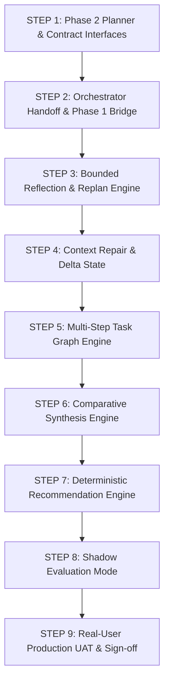

# PHASE 2 ARCHITECTURE & IMPLEMENTATION PLAN (REVISED)
**Document ID**: `PHASE2_IMPLEMENTATION_PLAN.md`  
**Baseline Anchor**: Commit `353559c2c8f0686c6cb6f2a871e66dc348cc558d`  
**Git Tag**: `phase1-freeze` (`git rev-parse phase1-freeze` = `353559c2c8f0686c6cb6f2a871e66dc348cc558d`)  
**Status**: `APPROVED IN CONCEPT / DESIGN REVISION COMPLETED`  
**Execution Policy**: `PHASE 1 = FROZEN (IMMUTABLE GROUNDED CORE)`, `PHASE 2 = ORCHESTRATION & REASONING LAYER`

---

## 1. BASELINE IMMUTABILITY & TRACEABILITY VERIFICATION

- **Verified Commit**: `353559c2c8f0686c6cb6f2a871e66dc348cc558d` (memuat seluruh hasil audit 299 test cases legacy engine / 333 total Phase 1 canonical 100% green, serta koreksi dokumentasi UQ-12 PMB portal authority dan UQ-21 work-study evidence limitation).
- **Verified Tag**: `git rev-parse phase1-freeze` menghasilkan tepat `353559c2c8f0686c6cb6f2a871e66dc348cc558d`.
- **Aturan Immutabilitas**:
  - Kode logika Phase 1 pada direktori `src/core/` (kecuali injection switch non-invasif) berstatus **READ-ONLY / IMMUTABLE**.
  - Seluruh 333 test cases Phase 1 (299 Legacy Engine + 34 Greenfield Core) wajib selalu dieksekusi dan tidak boleh diubah atau dilemahkan.
  - Setiap perubahan Phase 2 ditempatkan pada namespace terisolasi `src/reasoning/` dan `tests/phase2/` (atau test suite berawalan `tests/phase2`).

---

## 2. UNIFIED EXECUTION BUDGET & TIMEOUT POLICY

### Kebijakan Tunggal: `2.500 ms` per User Turn

Untuk menghilangkan kontradiksi durasi (sebelumnya ada 1.800 ms dan 2.500 ms), ditetapkan satu angka tunggal resmi:

```javascript
const PHASE2_EXECUTION_BUDGET_MS = 2500;
```

Nilai ini ditegakkan seragam pada seluruh modul:
- `phase2Planner.js`: Batas analisis planning & dekomposisi task graph.
- `reflectionReplanEngine.js`: Replan guard seketika membatalkan replan jika elapsed time $\ge$ 1.500 ms untuk menyisakan waktu bagi sintesis & verifikasi.
- `phase2Orchestrator.js`: Global turn timeout Promise race pada 2.500 ms.
- `tests`: Batas maksimal latency per request (assertion `latency <= 2500`).

### Justifikasi Pemilihan Angka 2.500 ms:
1. **Nominal Latency Stack**:
   - Planning & Ambiguity Check: ~50–100 ms
   - Initial Retrieval + Evidence Arbitration (Phase 1): ~350–550 ms
   - Reflection & Gap Analysis: ~30–50 ms
   - (Maksimal 1x Replan) Targeted Retrieval + Arbitration: ~350–550 ms
   - Grounded Synthesis / Formatting: ~400–700 ms
   - Final Verification Gate: ~20–50 ms
   - Total nominal latency kondisi terberat (dengan replan): ~1.200–2.050 ms.
2. **Buffer Jitter & Pool Safety**: Tersedia buffer 450 ms untuk fluktuasi koneksi pool database tanpa mengorbankan pengalaman pengguna WhatsApp.
3. **Standar Responsivitas WhatsApp**: Pengguna pesan instan mengharapkan respons dalam 2–3 detik, sementara webhook gateway WhatsApp (Fonnte/Cloud API) memiliki ambang timeout 5–10 detik. Angka 2.500 ms menjamin bot responsif dan bebas dari webhook retry ganda.

---

## 3. STRICT EVIDENCE GROUNDING & CLAIM PROVENANCE CONTRACT

### Definisi Faktual Terkalibrasi (Bukan "Zero Parametric Memory" Literal)
Aturan grounding didefinisikan secara operasional:
> **"LLM/Reasoning Layer DILARANG menghasilkan factual claim yang tidak memiliki rujukan evidence yang diterima (ACCEPTED) oleh Phase 1."**

#### Batasan Peran LLM:
- **LLM BOLEH**:
  - Memahami variasi bahasa alami pengguna (sinonim, kolokial, elipsis).
  - Menguraikan intent dan merancang alur task graph.
  - Merangkum, memformat, dan membandingkan teks bukti resmi yang diterima.
  - Memilih struktur penyampaian yang ramah pembaca WhatsApp.
- **LLM DILARANG KERAS**:
  - Menambahkan fakta dari memori bawaan model (angka biaya, tanggal, nama pejabat/kampus).
  - Mengisi informasi yang kosong berdasarkan asumsi (*no gap fabrication*).
  - Mengarang angka rupiah, persentase potongan semu, atau skema cicilan fiktif.
  - Mengarang jadwal pendaftaran atau tanggal gelombang.
  - Mengarang persyaratan berkas, alur seleksi, atau aturan akademik.
  - Membuat klaim program studi di luar daftar resmi ITB STIKOM Bali.
  - Memberikan opini rekomendasi subjektif tanpa dukungan bukti kurikulum/profil.

### Kontrak Pelacakan Bukti (*Claim Provenance Contract*):
Setiap poin atau klaim dalam jawaban akhir harus dapat ditelusuri ke tuple bukti terverifikasi:

```typescript
interface ClaimProvenance {
  claimText: string;             // Kalimat klaim pada jawaban
  evidenceId: string;            // ID chunk resmi (misal: "chunk_sk_629_lamp1_biaya_ti")
  sourceDocument: string;        // Dokumen sumber (misal: "SK No. 629/ITBSTIKOM/WDS/X/25")
  targetEntity: string;          // Entitas resmi (misal: "S1 Teknologi Informasi")
  targetAspect: string;          // Aspek (misal: "TUITION_FEE_SEMESTER")
  temporalScope: string;         // Periode (misal: "T.A. 2026/2027")
  verificationStatus: 'VERIFIED' | 'DISCLAIMER_DATA_GAP';
}
```

Jika suatu aspek ditanyakan namun `verificationStatus` tidak memiliki `evidenceId` yang sah $\rightarrow$ **Klaim dilarang dibuat**, bot wajib secara transparan menyertakan kalimat disclaimer keterbatasan data.

---

## 4. STRICT PHASE 1 REPLAN HAND-OFF CONTRACT

Replan pada Phase 2 **TIDAK PERNAH** mengambil dokumen sendiri secara langsung (*no autonomous chunk fetching*).

### Alur Wajib Replan:
```
Phase 2 Reflection Engine
    │
    ▼ (Deteksi Mismatch Istilah / Missing Aspect)
Generate Revised Retrieval Plan
    │
    ▼ (Hand-off kembali ke Phase 1)
Phase 1: retrievalService.retrieveCandidates(revisedPlan)
    │
    ▼
Phase 1: evidenceArbiter.arbitrateEvidence(newCandidates, revisedPlan)
    │
    ▼
Phase 1: answerabilityGate.evaluateAnswerability(frame, arbitratedResult)
    │
    ▼ (Hasil bukti resmi yang telah diisolasi dan diverifikasi)
Phase 2 Review & Synthesis
```

### Invarian Replan:
1. Candidate baru yang dihasilkan dari replan **WAJIB** melewati `evidenceArbiter` (termasuk filter isolasi entitas sibling dan validitas tanggal).
2. Phase 2 dilarang menggunakan bypass chunk yang ditolak oleh Phase 1.
3. Budget Replan: **Maksimal 1 kali replan per User Turn** (bukan per subquery, tidak ada nested loop).

---

## 5. TASK GRAPH & FACT VS REASONING ISOLATION CONTRACT

Pada kueri multi-step berantai (*chained queries*), Step 2 dilarang menggunakan inferensi/asumsi spekulatif model dari Step 1 sebagai fakta dasar.

### Kontrak Context Passing Antar-Step:
Yang diperbolehkan diteruskan ke dependency langkah berikutnya **HANYA**:
- `verifiedEntity`: Entitas kanonikal resmi yang lolos verifikasi di Step 1.
- `verifiedAspect`: Aspek resmi yang teridentifikasi.
- `verifiedEvidence`: Kumpulan chunk yang berstatus `ACCEPTED` dari Step 1.
- `verifiedClaims`: Pernyataan faktual yang lolos uji provenance.
- `verifiedContextDelta`: Status pembatalan/penambahan slot sesi resmi.

### Contoh Skenario:
- **Pertanyaan Pengguna**: *"Kalau saya ambil Dual Degree HELP University, berapa biayanya?"*
- **Step 1 (Identifikasi Program & Validitas)**:
  - Input: *"Dual Degree HELP University"*
  - Output Terverifikasi: `entity: "Dual Degree HELP University"`, `source: "Pedoman Kerjasama Internasional"`, `evidenceId: "chunk_intl_help_01"`.
- **Step 2 (Pencarian Biaya Program Tersebut)**:
  - Step 2 mengambil `verifiedEntity` dari Step 1 untuk mengunci `targetEntities: ["Dual Degree HELP University"]`.
  - Step 2 **DILARANG** mengasumsikan biaya HELP sama dengan biaya S1 reguler (Rp6.5jt) jika evidence chunk biaya HELP terpisah atau belum tercantum.
  - Jika biaya HELP tidak tercantum dalam bukti resmi $\rightarrow$ Step 2 menghasilkan `SAFE_UNKNOWN` / rujukan ke admisi internasional, bukan menggeneralisasi angka reguler.

---

## 6. AMBIGUITY RESOLUTION & CONTEXT INHERITANCE POLICY

Bot tidak boleh secara membabi buta meminta klarifikasi pada setiap kueri pendek.

### Decision Rule Ambiguitas:
```text
IF query tidak menyebutkan entitas spesifik (misal: "Berapa biayanya?", "Syaratnya apa?"):
    IF activeSessionData memiliki activeEntity yang valid dan sesi masih segar (< 30 menit):
        → INHERIT CONTEXT: Gunakan activeEntity dari riwayat percakapan.
    ELSE:
        → DISAMBIGUATE: DILARANG menebak program studi secara acak.
        → Sampaikan rentang ringkas atau ajukan opsi klarifikasi terstruktur:
          "Untuk memberikan rincian biaya yang tepat, program studi mana yang ingin Kakak tanyakan?
           1. S1 Sistem Informasi
           2. S1 Teknologi Informasi
           3. S1 Sistem Komputer
           4. S1 Bisnis Digital"
```

---

## 7. DETERMINISTIC RECOMMENDATION ENGINE & SCORING CONTRACT

Untuk pertanyaan rekomendasi (contoh: *"Anak saya suka main medsos dan live TikTok, jurusan apa yang pas?"*), bot dilarang memberikan opini subjektif tanpa dasar.

### Recommendation Scoring Rule:
1. **Ekstraksi Atribut Preferensi Pengguna**:
   - Kata Kunci / Minat: `[social_media, content_creation, live_streaming, digital_selling]`
2. **Pencocokan Deterministik terhadap Matriks Kurikulum & Profil Lulusan Resmi**:
   - `S1 Bisnis Digital`: Profil lulusan memuat *Digital Marketing Specialist*, *E-Commerce Content Specialist*, kurikulum mencakup *Pemasaran Digital*, *Perilaku Konsumen Digital*. $\rightarrow$ **Match Score: 0.90**
   - `S1 Sistem Informasi`: Profil memuat *Technopreneur*, kurikulum mencakup *Enterprise Systems*, *UI/UX*. $\rightarrow$ **Match Score: 0.55**
   - `S1 Teknologi Informasi`: Profil memuat *Network Engineer*, *Software Developer*. $\rightarrow$ **Match Score: 0.20**
3. **Penyampaian Rekomendasi Terstruktur**:
   - Jika satu prodi memiliki skor tertinggi secara dominan $\rightarrow$ Sajikan prodi tersebut beserta kutipan kompetensi resmi dokumen dan prospek kerjanya.
   - Jika dua prodi memiliki skor yang dekat (misal Bisnis Digital & Sistem Informasi) $\rightarrow$ Tampilkan **kedua kandidat prodi secara berimbang** dengan menjabarkan perbedaan fokus keduanya.
   - **Wajib**: Menolak klaim mutlak *"Pasti paling cocok"* dan menyarankan konsultasi lanjutan dengan bagian admisi PMB.

---

## 8. COMPARISON ENGINE & PARTIAL EVIDENCE CONTRACT

Untuk kueri perbandingan antar-prodi (misal: *"Sistem Informasi vs Sistem Komputer"*):

### Format 3 Pilar Komparasi:
1. **Fokus Keilmuan & Arah Kompetensi**
2. **Mata Kuliah / Bidang Kajian Inti**
3. **Prospek Karier / Profil Lulusan**

### Penanganan Ketiadaan Data (*Partial Evidence Invariant*):
- Jika salah satu pilar tidak memiliki evidence chunk resmi pada salah satu entitas:
  - **DILARANG MENGARANG** atau meminjam pilar dari entitas sebelah.
  - Sistem wajib secara eksplisit mencantumkan:  
    *"Informasi rincian [Mata Kuliah/Prospek Karier] resmi untuk program studi [Nama Prodi] saat ini belum tercantum secara lengkap dalam panduan yang tersedia. Untuk detail kurikulum silakan menghubungi admisi kampus."*

---

## 9. BOUNDED REPLAN BUDGET (TURN-LEVEL LIMIT)

- **Budget Replan Global**: Maksimal **1 kali replan per User Turn**.
- Pada kueri multi-intent dengan beberapa subquery, replan budget dialokasikan secara terpusat: jika Subquery 1 sudah memicu replan, maka Subquery 2 dilarang memicu replan lagi.
- Waktu maksimum pemrosesan seluruh giliran percakapan dikunci pada `2.500 ms`.

---

## 10. SHADOW EVALUATION MODE (CANARY BEFORE CUTOVER)

Sebelum jawaban Phase 2 dilepas ke WhatsApp production, sistem menyediakan **Shadow Mode**:

```javascript
// Environment Configuration
ENABLE_PHASE2_REASONING = process.env.ENABLE_PHASE2_REASONING === 'true';
PHASE2_SHADOW_MODE = process.env.PHASE2_SHADOW_MODE === 'true';
```

### Logika Eksekusi Shadow Mode:
1. Saat pesan masuk di production, pipeline menjalankan **Phase 1 (Production Master)** dan secara paralel/asinkron menjalankan **Phase 2 (Shadow Evaluator)**.
2. Jawaban yang dikirimkan ke pengguna tetap **100% Phase 1 Answer**.
3. Hasil Phase 1 dan Phase 2 dicatat ke dalam log evaluasi komparatif:
   - Kesesuaian Entitas (`entityMatch`)
   - Kesesuaian Intent (`intentMatch`)
   - Jumlah & Kesamaan Bukti (`evidenceOverlap`)
   - Latensi Pemrosesan (`p1Latency` vs `p2Latency`)
   - Status Verifikasi Akhir (`p2VerificationPass`)
   - Deteksi Regresi (`regressionDetected: boolean`)
4. Jika hasil evaluasi shadow membuktikan stabilitas dan 0 regresi pada data real, flag diubah menjadi `ENABLE_PHASE2_REASONING=true` dan `PHASE2_SHADOW_MODE=false`.

---

## 11. ACCEPTANCE CRITERIA & GATE TESTING PHASE 2

Phase 2 **TIDAK BOLEH** dinyatakan selesai hanya karena 35 unit test baru lulus. Kriteria kelulusan resmi:

1. **Phase 1 Baseline Green**: Seluruh **333 / 333 test cases** Phase 1 (299 Legacy Engine + 34 Greenfield Core) tetap 100% PASS.
2. **Phase 2 Reasoning Suite Green**: Seluruh test cases baru Phase 2 100% PASS (Step 1: 17, Step 2: 10, Step 3: 10, dll).
3. **Zero Invariant Regression**:
   - Nol kebocoran entitas (*zero sibling leak*).
   - Nol pemalsuan temporal (*zero ungrounded currentness claims*).
   - Nol kebocoran format database/OCR (*zero raw leak*).
4. **Real-User UAT Verification**: Pengujian langsung pada 12 topik UAT kritis:
   - Program Dual Degree (HELP & DNUI)
   - Follow-up *"Berapa rincian biayanya?"* setelah entitas dipilih
   - Perbandingan SI vs SK
   - Rekomendasi prodi berbasis preferensi minat
   - Program Rekognisi Pembelajaran Lampau (RPL)
   - Status Akreditasi Institusi & Prodi
   - Visa / Izin Belajar Mahasiswa Asing
   - Beasiswa SKSS & KIP Kuliah
   - Profil S1 Bisnis Digital
   - Pembagian Beban SKS Semester
   - Percakapan Multi-Turn Bersambung (10 skenario)
   - Penolakan Klaim Fiktif (Kelas Malam reguler, kedokteran)

---

## 12. STANDARISASI LOGGING PENGUJIAN PHASE 2

Setiap test case Phase 2 wajib mengeluarkan log diagnostik terstruktur dengan 13 atribut:

```text
================================================================
PHASE 2 DIAGNOSTIC EXECUTION RECORD
================================================================
QUERY               : [Teks pertanyaan asli]
CONTEXT             : [Konteks sesi / entitas aktif sebelumnya]
PLAN                : [Kategori tugas: DIRECT / COMPARISON / RECOMMENDATION / AMBIGUOUS]
TASK GRAPH          : [Daftar sub-task & dependency]
REPLAN COUNT        : [0 atau 1]
EVIDENCE IDS        : [Daftar ID chunk bukti resmi yang diterima]
SUPPORTED CLAIMS    : [Klaim faktual yang didukung bukti]
MISSING INFORMATION : [Aspek yang tidak ditemukan dalam bukti resmi]
FINAL ANSWER        : [Teks jawaban akhir]
VERIFICATION        : [PASS / FAIL dengan reason]
LATENCY             : [Waktu eksekusi dalam ms]
FALLBACK            : [NONE / PHASE1_FALLBACK / SAFE_UNKNOWN]
RESULT              : [PASS / FAIL]
================================================================
```

---

## 13. STRICT IMMEDIATE FAILURE & FALLBACK POLICY

Jika terjadi kendala pada Phase 2:
- Reasoning Syntax/Logic Error
- Timeout melampaui `2.500 ms`
- Gagal sintesis / unhandled exception
- Jawaban gagal diverifikasi oleh `finalAnswerVerifier.js`

**Mekanisme Penanganan**:
- **SEKETIKA BERHENTI (STOP)**.
- Dilarang membuat loop pemulihan rekursif (*no recursive recovery loop*).
- Seketika alihkan eksekusi (*instant fall-through*) ke **Phase 1 Deterministic Core**. Pengguna dijamin selalu menerima jawaban resmi yang aman.

---

## 14. INCREMENTAL 9-STEP IMPLEMENTATION ROADMAP

Pengembangan Phase 2 dilakukan secara bertahap dan terisolasi:



Setiap langkah wajib melewati audit kode, unit test independen, dan verifikasi regresi 333 test Phase 1 (299 Legacy Engine + 34 Greenfield Core) sebelum melangkah ke langkah berikutnya.

---

## 15. TARGET SEGERA: STEP 1 (PHASE 2 PLANNER & CONTRACTS)

Langkah awal yang akan dikerjakan secara eksklusif:
1. Membuat antarmuka kontrak `src/reasoning/contracts.js` (mendefinisikan schema `ExecutionPlan`, `TaskNode`, `ClaimProvenance`, `ReplanState`).
2. Membuat modul `src/reasoning/phase2Planner.js`:
   - Deteksi tipe kueri (Direct, Ambiguous, Multi-Step, Comparison, Recommendation).
   - Identifikasi kebutuhan klarifikasi vs pewarisan konteks aktif.
   - Pembangunan task graph awal tanpa eksekusi database.
3. Membuat test suite awal `tests/phase2/phase2Planner.test.js` untuk menguji fungsionalitas planner secara murni.
